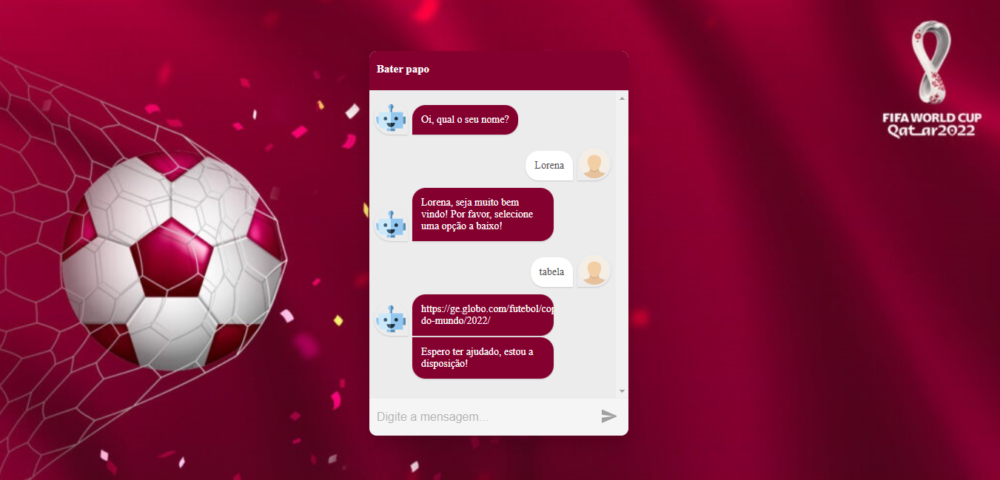
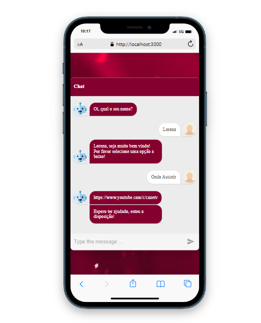

 

  <h1>Bem Vindos(as)!!</h1>
  <strong>ChatBot with Library</strong>

 

## ✌️ ChatBot with Library
<strong>ChatBot com library, em comparação ao ChatBot feito anteriormente o resultado é sem dúvida a otimização do tempo. Muito rápido e fácil de programar, ele te dá opções de múltipla escolhas com objetos... um objeto que chama outro objeto e assim segue... é claro que tudo dependo do projeto, mas este resolve o problema de forma muito mais rápido... 

    
    
   

    

### 🎨 Frontend

*  **ReactJS**: com Visual Studio Code 

## 🙌 Quer Contribuir?

Estamos abertos a todos os tipos de contribuições. Se você quiser:
* 🤔 Sugira um recurso
* 🐛 Informar um problema
* 📖 Melhore a documentação
* 👨‍💻 Contribua com o código

Você é mais que bem vindo. 

Obs: Todos os textos e imagens atuais são ficticios, projeto não concluso.

    <h6>Feito com ❤️ by DebsLorena</h6>
    <a href="https://www.linkedin.com/in/loredebs/"><strong>Linkedin</strong></a> 
    <a href="https://www.instagram.com/debslorena/"><strong>Instagram</strong></a>

